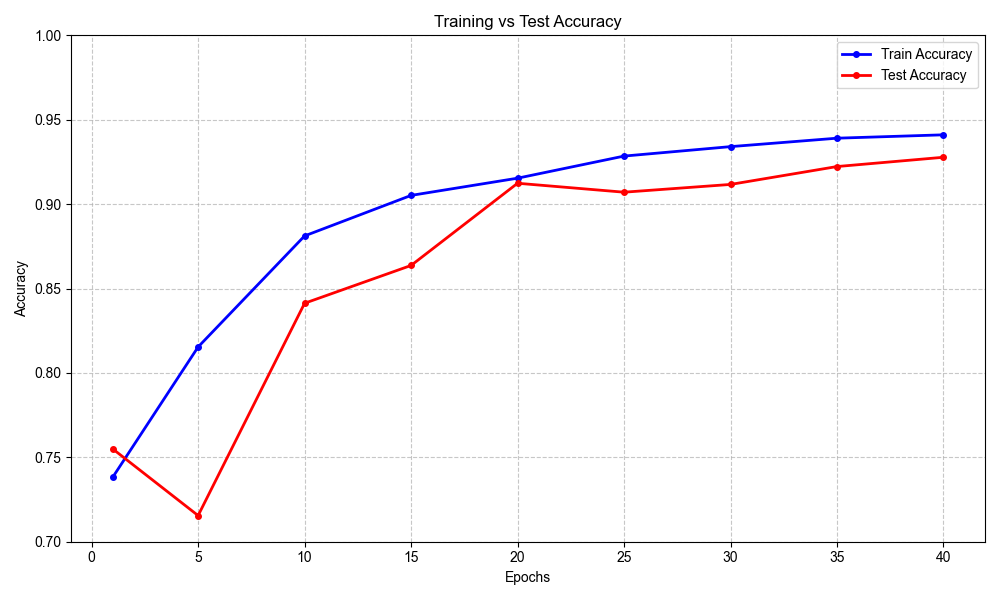
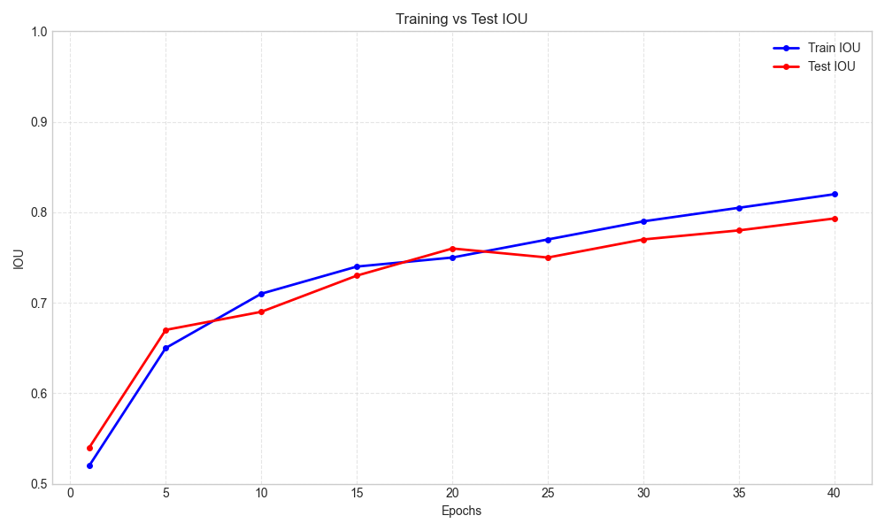

# Introduction

This is a project to train on 3D Vision, The datasets used will mainly be Teeth3Ds and ShapeNet

## usage

## Implemented Models Results

[Trained models can be found here](https://drive.google.com/drive/folders/1HkosNZrBiGC8gFM38o_f9LQ0fARovoV5?usp=drive_link)

| Model  | Accuracy | IoU |
| ------ | -------- | --- |
| PointNet|  |  |

PointNet and PointNet++ structre was inspired by [yanx27 repo](https://github.com/yanx27/Pointnet_Pointnet2_pytorch/tree/master)

[original repo](https://github.com/moyaser315/3dmodels.git)
